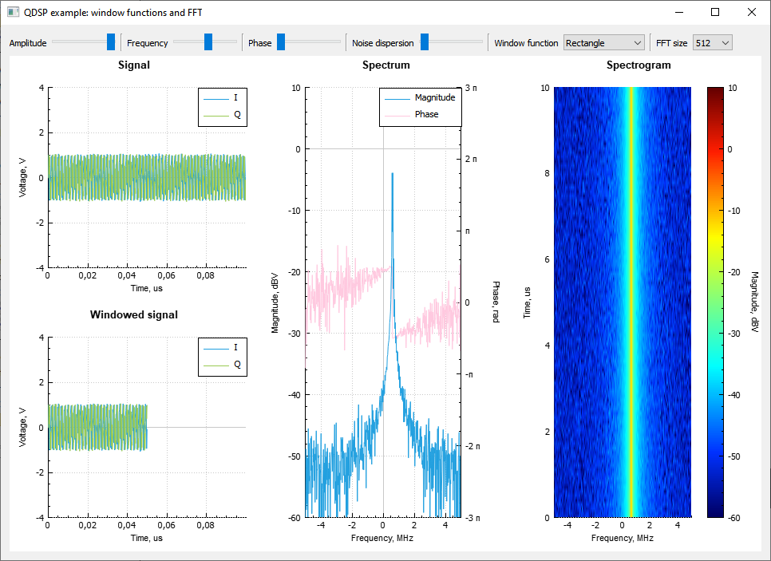
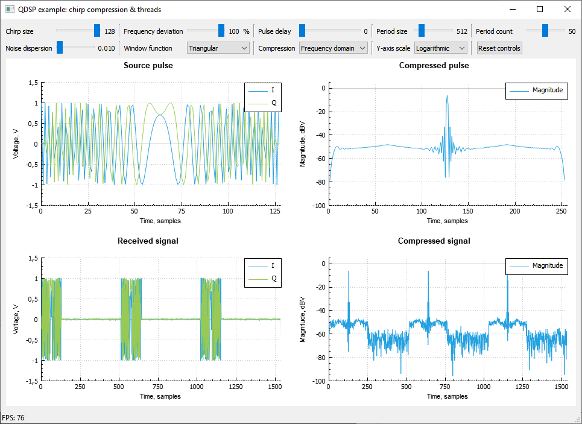

# Примеры к библиотеке

## Пример 1: быстрое преобразование Фурье и оконные функции.
Пример иллюстрирует работу одного из наиболее широко используемых алгоритмов
цифровой обработки сигналов - быстрого преобразования Фурье(БПФ). Для улучшения
результатов БПФ перед его вычислением сигнал подвергается специальному
преобразованию - оконному сглаживанию с помощью специальных оконных функций.
Пользователь может задать амплитуду, частоту и начальную фазу исходного сигнала,
дисперсию аддитивного белого гауссовского шума, выбрать оконную функцию и размерность БПФ.
Для визуализации сигналов используется библиотека QCustomPlot (https://www.qcustomplot.com).
Визуализирован исходный сигнал, подвергнутый оконному сглаживанию сигнал и
результаты БПФ, историю которых можно проследить на спектрограмме.

## Пример 2. Сжатие ЛЧМ-импульса. Использование потоков.
Пример иллюстрирует специальный алгоритм обработки сигналов, широко используемый
в радиолокации, - сжатие импульса с линейно-частотной модуляцией (ЛЧМ-импульса).
Данный алгоритм реализуется с помощью свёртки принятого сигнала с сохранённым в
памяти излучённым ЛЧМ-импульсом. Алгоритм реализуется двумя способами: в
частотной и временной областях. Для повышения производительности обработка
сигнала проводится в отдельном потоке. Пользователь может задать длительность
ЛЧМ-импульса, девиацию частоты, задержку принятого импульса и его период
повторения. Имеется возможность добавления шумов к принятому сигналу, наложения
оконных функций, выбора способа реализации алгоритма и маштаба для отображения
результатов работы выбранного алгоритма. Для визуализации сигналов используется
библиотека QCustomPlot (https://www.qcustomplot.com). Имеется возможность
сравнительной оценки производительности двух способов реализации алгоритмов.

