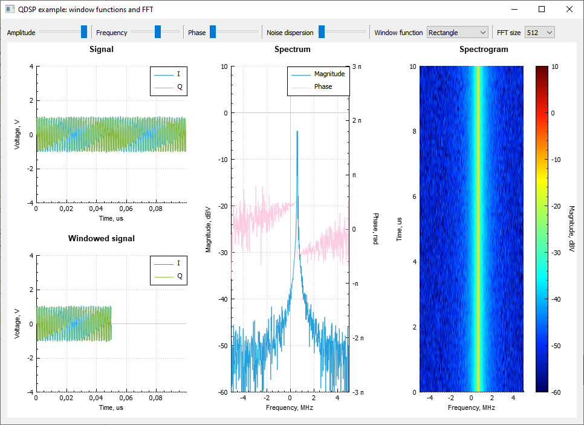

# Пример 1: быстрое преобразование Фурье и оконные функции.
## Общее описание
Пример иллюстрирует работу одного из наиболее широко используемых алгоритмов
цифровой обработки сигналов - быстрого преобразования Фурье(БПФ). Для улучшения
результатов БПФ перед его вычислением сигнал подвергается специальному
преобразованию - оконному сглаживанию с помощью специальных оконных функций.
Пользователь может задать амплитуду, частоту и начальную фазу исходного сигнала,
величину аддитивного белого шума, выбрать оконную функцию и размерность БПФ.
Для визуализации сигналов используется библиотека QCustomPlot (https://www.qcustomplot.com).
Визуализирован исходный сигнал, подвергнутый оконному сглаживанию сигнал и
результаты БПФ, историю которых можно проследить на спектрограмме.



## Настройка интерфейса программы
Для возможности выбора пользователем функции для оконного сглаживания создаётся
вектор указателей на экземпляры классов, генерирующих оконные функции:
```C++
windowFunctions_ << QSharedPointer<QAbstractWindow>(new QRectangleWindow)
                 << QSharedPointer<QAbstractWindow>(new QBarthannWindow)
                 << QSharedPointer<QAbstractWindow>(new QBlackmanWindow)
                 << QSharedPointer<QAbstractWindow>(new QBlackmanHarrisWindow)
                 << QSharedPointer<QAbstractWindow>(new QBohmanWindow)
                 << QSharedPointer<QAbstractWindow>(new QFlattopWindow)
                 << QSharedPointer<QAbstractWindow>(new QGaussianWindow)
                 << QSharedPointer<QAbstractWindow>(new QHammingWindow)
                 << QSharedPointer<QAbstractWindow>(new QHannWindow)
                 << QSharedPointer<QAbstractWindow>(new QNuttallWindow)
                 << QSharedPointer<QAbstractWindow>(new QParzenWindow)
                 << QSharedPointer<QAbstractWindow>(new QTriangularWindow)
                 << QSharedPointer<QAbstractWindow>(new QTukeyWindow);
```
Можно использовать и "сырые" указатели, однако в таком случае для каждого элемента
вектора необходимо будет вызвать `delete` в деструкторе класса, где создаётся вектор.

Каждый класс генератора оконных функций имеет виртуальный метод, возвращающий
название оконной функции. Поэтому на основе созданного вектора заполняем
выпадающий список с оконными функциями:
```C++
for (const auto window: windowFunctions_) {
    ui->windowComboBox->addItem(window->name());
}
```
При изменении выбранного элемента выпадающего списка генерируется новая оконная
функция, для чего соедияем соответствующие сигнал и слот выпадающего списка и
основного виджета:
```C++
connect(ui->windowComboBox, qOverload<int>(&QComboBox::currentIndexChanged),
        this, &Widget::updateWindow);
```
Слот для генерации новой оконой функции:
```C++
void Widget::updateWindow(int index)
{
    window_ = windowFunctions_[index]->makeWindow(fft_->size());
}
```
Для выбора размерности БПФ создаётся отдельный выпадающий список, сигнал
изменения которого подсоединяется к слоту изменения размерности БПФ:
```C++
for (int fftSize = fftSizeMin; fftSize <= fftSizeMax; fftSize = qNextPowerOfTwo(fftSize)) {
    fftSizes_ << fftSize;
    ui->fftSizeComboBox->addItem(QString::number(fftSize));
}
connect(ui->fftSizeComboBox, qOverload<int>(&QComboBox::currentIndexChanged),
        this, &Widget::updateFftSize);
```
При изменении размерности БПФ необходимо изменить также длину оконной функциии
пересчитать значения горизонтальной оси для отображения графика:
```C++
void Widget::updateFftSize(int index)
{
    fft_->setSize(fftSizes_[index]);

    spectrogram_->data()->clear();
    spectrogram_->data()->setSize(fft_->size(), spectrogramSize);
    spectrogram_->data()->setKeyRange(QCPRange(-samplingFreq.MHz()/2,
                                               samplingFreq.MHz()/2));
    spectrogram_->data()->setValueRange(QCPRange(0, timeScaleMax * spectrogramSize));
    spectrogram_->data()->fill(-100);

    updateWindow(ui->windowComboBox->currentIndex());

    updateKeys();
}
```
Пересчитаываемые значения обновляются в отдельном методе:
```C++
void Widget::updateKeys()
{
    frequencyKeys_.resize(fft_->size());
    for (int i = 0; i < fft_->size(); ++i) {
        frequencyKeys_[i] = ((double)i/fft_->size() - 0.5) * samplingFreq.MHz();
    }

    windowedTimeKeys_ = timeKeys_.mid(0, fft_->size());
}
```
Значения для горизонтальной оси графика исходного сигнала подготавливаются в
конструкторе виджета:
```C++
for (int i = 0; i < fftSizeMax; ++i) {
    timeKeys_.append(((double)i / fftSizeMax) * timeScaleMax);
}
```
Выставляются начальные настройки интерфейса:
```С++
ui->windowComboBox->setCurrentIndex(0);
ui->fftSizeComboBox->setCurrentIndex(4);
```

Обновление графиков происходит по таймеру:
```С++
mainTimer_->setInterval(msecInSec / displayFps);
connect(mainTimer_, &QTimer::timeout, this, &Widget::updateGraphs);
mainTimer_->start();
```

## Генерация анализируемого сигнала
```C++
QComplexSignal result = QComplexSignal::harmonic(
            fftSizes_.last(), samplingFreq,
            QFrequency(((double)ui->frequencySlider->value() / ui->frequencySlider->maximum() - 0.5) * samplingFreq),
            (double)ui->amplitudeSlider->value() / ui->amplitudeSlider->maximum() * sourceSignalMaxVoltage,
            (double)ui->phaseSlider->value() / ui->phaseSlider->maximum() * sourceSignalMaxPhase);
```
Добавляется аддитивный гауссовский шум.
```C++
QComplexSignal::gaussianNoise(result.begin(), result.size(),
            (double)ui->noiseDispersionSlider->value() / ui->noiseDispersionSlider->maximum());
```

## Оконное сглаживание
Оконное сглаживание происходит с момощью операции умножения исходного сигнала на
результат вычисления оконной функции заданного размера.
Размер окна и исходного сигнала разный, поэтому размер результата будет
соответствовать меньшему из двух сигналов - размеру окна.
```C++
QComplexSignal windowedSignal = source * window_;
```
Результирующий сигнал `windowedSignal` и будет являться аргументом для быстрого
преобразования Фурье.

## Вычисление БПФ
Спектр сигнала вычисляется с помощью вызова шаблонного метода
`QComplexSignal compute(const T& signal) const` класса `QFft`:
```C++
QComplexSignal spectrum = fft_->compute(windowedSignal);
```
Результат вычисления мало информативен для человечека, поэтому подвергается
дальнейшему преобразованию.

## Интерпретация результатов БПФ
Спектр дискретного сигнала определяется на интервале [0, Fd), где Fd - частота
дискретизации. Однако для человечека более наглядным является интервал частот
[-Fd/2, Fd/2). Для этого спектр сигнала циклически сдвигается на половину своего
размера, чтобы нулевая частота оказалась в центре. Для этого используются
стандартные алгоритмы библиотеки STL.

Циклический сдвиг спектра сигнала:
```C++
std::rotate(spectrum.begin(), spectrum.begin() + spectrum.size()/2, spectrum.end());
```
Амплитудный и фазовый спектры вычисляются поэлементно как модуль и аргумент
комплексного спектра.

Спектр в логарифмическом масштабе:
```C++
QRealSignal magnitude( spectrum.size(), spectrum.clock());
std::transform(spectrum.begin(), spectrum.end(), magnitude.begin(),
               [](QComplex x){ return factorToDb(abs(x)); });
```

Фаза в диапазоне [-Pi...Pi]:
```C++
QRealSignal phase(spectrum.size(), spectrum.clock());
std::transform(spectrum.begin(), spectrum.end(), phase.begin(),
               [](QComplex x){ return arg(x); });
```

## Отрисовка результатов
Обновление данных на графиках происходит вызовом метода `void QCPGraph::
setData(const QVector<double> &keys, const QVector<double> &values, bool alreadySorted)`.
Аргументы передаются в виде `QVector<double>`:
```C++
iGraph_->setData(timeKeys_, source.i().asQVector(), true);
qGraph_->setData(timeKeys_, source.q().asQVector(), true);

windowedIGraph_->setData(windowedTimeKeys_, windowedSignal.i().asQVector(), true);
windowedQGraph_->setData(windowedTimeKeys_, windowedSignal.q().asQVector(), true);

magnitudeGraph_->setData(frequencyKeys_, magnitude.asQVector(), true);
phaseGraph_->setData(frequencyKeys_, phase.asQVector(), true);
```
Если для представления чисел в QDsp используется тип `float` (установлено
QDSP_FLOAT_DISCRETE), такой способ работать не будет, и будет необходимо вручную
сформировать `QVector<double>`.
Спектрограмма представляется в виде двумерного массива чисел типа `double` и
формируется поточечно с помощью метода `void QCPColorMapData::setCell(int keyIndex, int valueIndex, double z)`.
Для создания движущейся спектрограммы после получения очередного спектра сигнала
необходимо каждый раз сдвигать данные в двумерном массиве:
```C++
for (int row = spectrogram_->data()->valueSize()-1; row > 0; --row) {
    for (int col = 0; col < spectrogram_->data()->keySize(); ++col) {
        spectrogram_->data()->setCell(col, row, spectrogram_->data()->cell(col, row-1));
    }
}
```
Добавление новых данных в спектрограмму:
```C++
for (int i = 0; i < magnitude.size(); ++i) {
    spectrogram_->data()->setCell(i, 0, magnitude[i]);
}
```
Отрисовка графиков:
```C++
ui->plot->replot();
```


