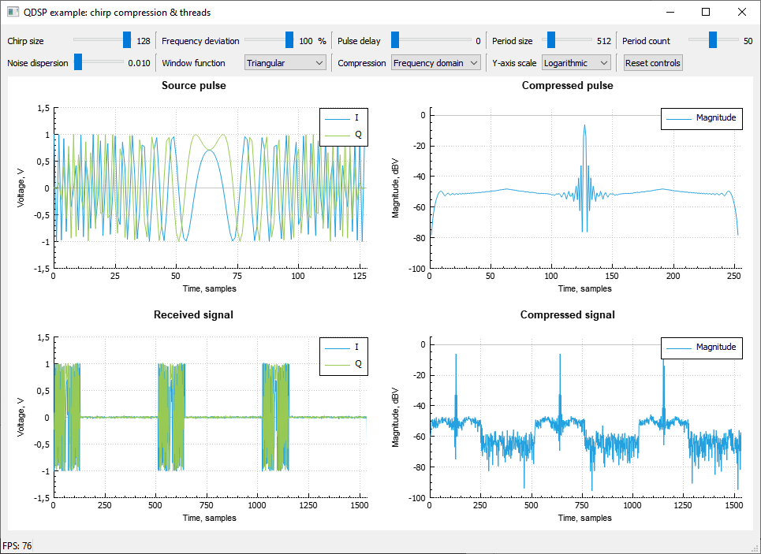

# Пример 2. Сжатие ЛЧМ-импульса. Использование потоков.
## Общее описание
Пример иллюстрирует специальный алгоритм обработки сигналов, широко используемый
в радиолокации, - сжатие импульса с линейно-частотной модуляцией (ЛЧМ-импульса).
Данный алгоритм реализуется с помощью свёртки принятого сигнала с сохранённым в
памяти излучённым ЛЧМ-импульсом. Алгоритм реализуется двумя способами: в
частотной и временной областях. Для повышения производительности обработка
сигнала проводится в отдельном потоке. Пользователь может задать длительность
ЛЧМ-импульса, девиацию частоты, задержку принятого импульса и его период
повторения. Имеется возможность добавления шумов к принятому сигналу, наложения
оконных функций, выбора способа реализации алгоритма и маштаба для отображения
результатов работы выбранного алгоритма. Для визуализации сигналов используется
библиотека QCustomPlot (https://www.qcustomplot.com). Имеется возможность
сравнительной оценки производительности двух способов реализации алгоритмов.

## Настройка интерфейса программы

## Формирование ЛЧМ-импульса

## Генерация принятого сигнала

## Реализация алгоритма сжатия во временной области

## Реализация алгоритма сжатия в частотной области

## Отрисовка результатов
